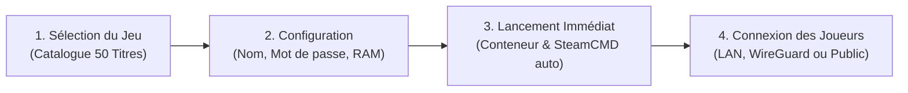

<div align="center">
  
  <br/><br/>

  # 🎮 Noos Game Eggs Hub
  ### *La Plateforme Officielle de Serveurs de Jeux Vidéo Dédiés & Souverains pour Noos NAS*

  [](https://github.com/Chomiam/noos_nas_eggs)
  [](#)
  [](#)
  [](#)
  [](#)
  [](#)
  [](LICENSE)

  <p align="center">
    <strong>Reprenez le contrôle de vos parties multijoueurs. Hébergez vos mondes privés directement sur votre propre serveur de stockage, sans abonnement, sans bridage de slots et sans intermédiaire.</strong>
  </p>
</div>

---

## 🌟 La Révolution du Gaming Privé : Pourquoi Choisir Noos NAS ?

Louer un serveur de jeu auprès d'hébergeurs commerciaux conventionnels (Nitrado, G-Portal, Shockbyte, Zap-Hosting) représente une dépense récurrente inutile, des limitations artificielles sur la mémoire RAM, un bridage du processeur et la perte irrémédiable de vos sauvegardes au moindre retard de paiement.

Avec **Noos Game Eggs Hub**, votre équipement réseau et de stockage domestique se transforme instantanément en une infrastructure de jeu professionnelle :

| Critères | Hébergeurs Traditionnels en Ligne | 🎮 Noos Game Eggs Hub |
| :--- | :--- | :--- |
| **Coût d'utilisation** | 10 € à 45 € par mois et par jeu | **0 € / mois (Rentabilité immédiate)** |
| **Limitation de Joueurs** | Facturation restrictive au slot (ex: 8 à 32 slots) | **Illimité (Selon la puissance de votre matériel)** |
| **Performances & Latence** | Serveurs partagés surchargés (*noisy neighbors*) | **Ressources dédiées, stockage NVMe ultra-véloce** |
| **Propriété des Sauvegardes** | Accès restreint ou suppression après résiliation | **100 % Souverain, sauvegardes locales préservées** |
| **Sécurité & Réseau** | Exposition directe d'adresses IP publiques | **Accès Zero-Trust via VPN WireGuard ou LAN local** |
| **Simplicité d'installation** | Fichiers de configuration manuels et fastidieux | **Déploiement en 1-clic automatisé depuis l'interface** |

---

## ⚡ Les Avantages Clés pour les Joueurs et Administrateurs

- 🚀 **Déploiement Automatisé en 1-Clic** : SteamCMD, compatibilité Proton/Wine pour les binaires Windows, runtimes Java et .NET sont téléchargés et configurés automatiquement par l'Egg.
- 🔒 **Cloisonnement & Isolation Étanches** : Chaque serveur s'exécute dans un conteneur Docker restreint avec quotas mémoires stricts, garantissant l'intégrité absolue de vos fichiers système et de vos partages NAS.
- 🌐 **Connectivité Multijoueur Simplifiée** :
  - **Réseau Local (LAN)** : Jouez avec vos proches sur le même réseau domestique avec une latence quasi-nulle (< 1 ms).
  - **Réseau Privé WireGuard** : Connectez vos amis à distance dans un tunnel chiffré sans ouvrir le moindre port sur votre box internet.
  - **Accès Direct Internet** : Ports de jeu et ports de requête Steam Query pré-assignés pour les communautés publiques.
- 💬 **Console d'Administration & Télé-Commandes** : Accès direct aux consoles interactives en temps réel (`/op`, `/kick`, `/ban`, `/save-all`, console RCON, Telnet).
- 💾 **Protection Anti-Corruption des Données** : Extinction ordonnée avec signaux POSIX adaptés pour forcer la synchronisation du monde sur le disque avant l'arrêt du conteneur.

---

## 🎮 Catalogue Complet des 50 Jeux Certifiés

Chaque Egg a été minutieusement modélisé selon le standard **Pterodactyl V2**, traduit intégralement en français, validé en conditions réelles sous NixOS/Docker et enrichi d'illustrations haute définition (bannières panoramiques 1920×620 et logos officiels).

```
╔═══════════════════════════════════════════════════════════════════════════════════╗
║                      50 SERVEURS DE JEUX DÉDIÉS INTÉGRÉS                          ║
╚═══════════════════════════════════════════════════════════════════════════════════╝
 🏭 Usines & Gestion     : Satisfactory • Factorio • Foundry
 🦖 Dinosaures & Survie  : ARK: Survival Evolved • ARK: Survival Ascended
 🧟 Apocalypse & Horreur : 7 Days to Die • Sons of the Forest • The Forest • DayZ
                           Unturned • Project Zomboid • Killing Floor 2 • HumanitZ
                           No More Room in Hell • Night of the Dead
 🎯 FPS & Action         : Counter-Strike 2 • Counter-Strike: Source • Team Fortress 2
                           Left 4 Dead 2 • Garry's Mod • Squad • Insurgency: Sandstorm
                           Arma 3 • Black Mesa • Mordhau
 ⚔️ RPG & Légendes       : Valheim • Enshrouded • Conan Exiles • V Rising
                           Soulmask • Abiotic Factor • Icarus • Myth of Empires
 🚀 Espace & Aventure    : Space Engineers • Astroneer • Stationeers • Stormworks
                           Empyrion: Galactic Survival • Starbound • Barotrauma
 🧱 Voxel & Sandbox      : Minecraft Java • Minecraft Bedrock • Terraria
                           Core Keeper • Vintage Story • Eco • Don't Starve Together
 🏎️ Course Automobile    : Assetto Corsa
```

### Grille Technique Détaillée

| Jeu | Catégorie | RAM Recommandée | Ports Réseau | Description & Spécificités de l'Egg |
| :--- | :--- | :--- | :--- | :--- |
| **7 Days to Die** | Survie / Post-Apo | 8 Go | `26900/both`, `8081/tcp` | Serveur officiel V1.0+ avec panneau Telnet et cartes procédurales. |
| **ARK: Survival Ascended** | Survie / Dinosaures | 16 Go | `7777/udp`, `27015/udp` | Moteur Unreal Engine 5, exécution Proton avec mods CurseForge. |
| **ARK: Survival Evolved** | Survie / Dinosaures | 12 Go | `7777/udp`, `27020/tcp` | Prise en charge des cartes officielles et console d'administration RCON. |
| **Abiotic Factor** | Sci-Fi / Survie Coop | 8 Go | `7777/udp`, `27015/udp` | Exploration et survie scientifique souterraine en coopératif jusqu'à 6 joueurs. |
| **Arma 3** | Simulation Militaire | 8 Go | `2302/udp`, `2305/udp` | Opérations tactiques à grande échelle (Altis Life, Antistasi, Zeus). |
| **Assetto Corsa** | Course / Simulation | 4 Go | `9600/both`, `8081/tcp` | Simulation automobile de pointe avec gestion des sessions et circuits officiels. |
| **Astroneer** | Exploration Spatiale | 6 Go | `8777/udp` | Déformation de terrain procédurale, bases modulaires et exploration planétaire. |
| **Barotrauma** | Simulation Sous-Marine | 4 Go | `27015/udp`, `27016/udp` | Navigation sous-marine périlleuse sur Europe avec équipage coopératif. |
| **Black Mesa (BM:DM)** | FPS Multijoueur | 4 Go | `27015/both` | Le remake légendaire d'Half-Life en affrontement Deathmatch Source Engine. |
| **Conan Exiles** | Survie / Barbares | 8 Go | `7777/udp`, `27015/udp` | Domination des Terres Exilées, purges, esclaves et construction de forteresses. |
| **Core Keeper** | Aventure / Voxel 2D | 4 Go | `27015/udp` | Exploration minière dans une caverne infinie et combats de boss légendaires. |
| **Counter-Strike 2** | FPS Compétitif | 4 Go | `27015/both`, `27020/udp` | Serveur compétitif Source 2 avec tick rate élevé et mises à jour SteamCMD. |
| **Counter-Strike: Source** | FPS Compétitif | 2 Go | `27015/both` | Le classique indémodable (De_Dust2, GunGame, Deathmatch, SourceMod). |
| **DayZ** | Survie Post-Apo | 8 Go | `2302/udp`, `27016/udp` | Survie hardcore sans compromis sur Chernarus et Livonia avec météo et véhicules. |
| **Don't Starve Together** | Survie / Aventure | 4 Go | `10999/udp`, `11000/udp` | Support du clustering simultané (Surface + Grottes) et mods Workshop. |
| **Eco** | Écologie & Société | 8 Go | `3000/both`, `3001/both` | Simulation d'écosystème avec lois démocratiques, économie et interface web. |
| **Empyrion: Galactic Survival** | Survie Galactique | 8 Go | `30000/udp` | Construction de vaisseaux spatiaux capitaux (CV) et colonisation de planètes. |
| **Enshrouded** | Action RPG / Voxel | 8 Go | `15636/udp`, `15637/udp` | Monde voxel immersif d'Embervale avec exploration et construction avancée. |
| **Factorio** | Automatisation | 4 Go | `34197/udp`, `27015/tcp` | Serveur headless haute performance avec génération automatique de sauvegardes. |
| **Foundry** | Usine & Voxel | 8 Go | `22500/udp` | Chaînes de production modulaires et convoyeurs automatisés en monde infini. |
| **Garry's Mod** | Bac à sable Source | 4 Go | `27015/both`, `27005/udp` | Gamemodes communautaires populaires (DarkRP, TTT, Prop Hunt) et FastDL. |
| **HumanitZ** | Survie Isométrique | 6 Go | `7777/udp`, `27015/udp` | Survie en monde ouvert envahi de Zeeks avec conduite et artisanat. |
| **Icarus** | Survie Sci-Fi | 12 Go | `17777/udp`, `27015/udp` | Expéditions chronométrées sur une planète sauvage terraformée hostile. |
| **Insurgency: Sandstorm** | FPS Tactique | 6 Go | `27102/udp`, `27015/tcp` | Combats urbains ultraréalistes en escouade avec balistique exigeante. |
| **Killing Floor 2** | Horreur / Coopératif | 4 Go | `7777/udp`, `8080/tcp` | Survie par vagues contre les Zeds avec WebAdmin de configuration intégré. |
| **Left 4 Dead 2** | Horreur / Coopératif | 4 Go | `27015/both` | Campagnes coopératives à 4 et mode Versus compétitif à 8 joueurs. |
| **Minecraft: Bedrock Edition** | Bac à sable / Crossplay | 2 Go | `19132/udp` | Binaire officiel Mojang BDS pour Switch, PS4/PS5, Xbox, mobiles et Windows 10/11. |
| **Minecraft: Java Edition** | Bac à sable / Moddé | 4 Go | `25565/both` | Détection automatique Paper/Purpur/Fabric/Forge, gestion plugins et mémoire G1GC. |
| **Mordhau** | Combat Médiéval | 6 Go | `7777/udp`, `10000/tcp` | Batailles sanglantes à la première personne avec système de combat directionnel. |
| **Myth of Empires** | Sandbox Médiéval | 12 Go | `7777/udp`, `27015/udp` | Sièges colossaux, armées féodales et conquête territoriale en Asie médiévale. |
| **Night of the Dead** | Tower Defense / Survie | 8 Go | `7777/udp`, `27015/udp` | Bastions fortifiés automatisés et défense contre les hordes nocturnes de zombies. |
| **No More Room in Hell** | Survie Zombie | 2 Go | `27015/both` | Réalisme pur inspiré de Romero : munitions comptées, sans réticule, infection fatale. |
| **Palworld** | Aventure / Survie | 8 Go | `8211/udp` | Serveur multijoueur Palworld avec multithreading optimisé et capture de Pals. |
| **Project Zomboid** | Survie Hardcore | 4 Go | `16261/udp`, `16262/udp` | Le simulateur d'apocalypse zombie ultime avec persistance et mods Workshop. |
| **Rust** | Survie PvP / Craft | 8 Go | `28015/udp`, `28016/tcp` | Serveur officiel Facepunch avec console RCON et support de l'application Rust+. |
| **Satisfactory** | Usine / Automatisation | 8 Go | `7777/udp`, `8888/udp` | Automatisation d'usines extraterrestres colossales à la première personne. |
| **Sons of the Forest** | Horreur / Survie | 8 Go | `8766/udp`, `27016/udp` | Exploration et construction d'abris face aux cannibales d'une île mystérieuse. |
| **Soulmask** | Survie Tribale | 8 Go | `8777/udp`, `27015/udp` | Gestion de tribu, recrutement de membres et pouvoirs des masques ancestraux. |
| **Space Engineers** | Simulation Spatiale | 12 Go | `27016/udp` | Conception physique de vaisseaux, stations orbitales et véhicules planétaires. |
| **Squad** | FPS Tactique | 8 Go | `7787/udp`, `21114/tcp` | Combats interarmes modernes à 100 joueurs axés sur la coordination radio. |
| **Starbound** | Sandbox Spatial 2D | 4 Go | `21025/tcp` | Exploration intersidérale infinie, colonisation planétaire et quêtes multijoueur. |
| **Stationeers** | Ingénierie Spatiale | 6 Go | `27016/udp`, `27015/udp` | Simulation poussée de thermodynamique, réseaux électriques et pressurisation. |
| **Stormworks: Build & Rescue** | Sauvetage / Ingénierie | 6 Go | `25564/both` | Création de navires et aéronefs modulaires pour missions de sauvetage en mer. |
| **Team Fortress 2** | FPS Compétitif | 4 Go | `27015/both`, `27005/udp` | Affrontements 12v12 classiques, Mann vs Machine et modes compétitifs Source. |
| **Terraria** | Aventure 2D Sandbox | 2 Go | `7777/both` | Exploration, minage et affrontements de boss en binaire natif Linux 64-bit. |
| **The Forest** | Horreur / Survie | 6 Go | `27016/udp`, `8766/udp` | Survie coopérative en forêt hostile avec fabrication de camps et pièges. |
| **Unturned** | Survie Voxel Post-Apo | 4 Go | `27015/both`, `27016/udp` | Survie zombie en monde ouvert avec véhicules, artisanat et cartes officielles. |
| **V Rising** | Action RPG / Vampires | 8 Go | `9876/udp`, `9877/udp` | Bâtissez votre château gothique et régnez sur Vardoran en vampire seigneurial. |
| **Valheim** | Survie Mythologique | 4 Go | `2456/udp`, `2457/udp` | Monde procédural viking, construction nordique et exploration maritime. |
| **Vintage Story** | Survie Voxel Réaliste | 4 Go | `42420/tcp` | Survie intransigeante axée sur la géologie, la forge et les saisons (.NET 7). |

---

## 🖥️ Déploiement en 3 Étapes depuis le Noos NAS Dashboard

L'intégration native dans le [Noos NAS Dashboard](https://github.com/Chomiam/noos-nas-dashboard) rend la gestion d'un serveur de jeu aussi simple que l'installation d'une application mobile :



1. **Parcourez le Catalogue** : Accédez à l'onglet **Serveurs de Jeux** et sélectionnez votre titre parmi les 50 jeux certifiés.
2. **Personnalisez votre Monde** : Ajustez la mémoire allouée, donnez un nom à votre serveur et définissez un mot de passe optionnel.
3. **Jouez immédiatement** : Cliquez sur **Déployer**. Le tableau de bord télécharge automatiquement les fichiers du jeu via SteamCMD, applique les paramètres de sécurité et lance le serveur.
4. **Partagez les accès** : Les adresses IP de connexion (Locale, WireGuard et Publique) s'affichent instantanément pour vos amis.

---

## 🛠️ Structure & Anatomie d'un Egg Noos NAS

Le catalogue repose sur une architecture déclarative stricte et reproductible :

```text
noos_nas_eggs/
├── catalog.json              # Index global de distribution déclaratif (v1.2.0)
├── README.md                 # Vitrine et documentation commerciale
├── assets/
│   └── logo.png              # Logo officiel haute définition Noos NAS
└── eggs/
    └── <nom_du_jeu>/
        ├── egg.json          # Spécification Pterodactyl V2 (variables, ports, commande)
        ├── icon.png          # Logo officiel haute définition / capsule carrée
        └── banner.jpg        # Bannière panoramique au ratio 1920x620
```

### Extrait Déclaratif (`egg.json`)

```json
{
  "id": "valheim",
  "name": "Valheim Dedicated Server",
  "author": "Iron Gate & Noos NAS",
  "category": "Survie Mythologique",
  "icon": "⚔️",
  "tagline": "Serveur dédié viking persistant dans un monde procédural nordique",
  "steam_app_id": "896660",
  "docker_image": "ghcr.io/parkervcp/steamcmd:debian",
  "default_port": 2456,
  "port_protocol": "udp",
  "extra_ports": [
    { "port": 2457, "protocol": "udp", "description": "Port Steam Query" }
  ],
  "default_memory_mb": 4096,
  "min_memory_mb": 2048,
  "startup_cmd": "./valheim_server.x86_64 -name \"{{SERVER_NAME}}\" -port {{SERVER_PORT}} -world \"{{WORLD_NAME}}\" -password \"{{SERVER_PASSWORD}}\" -public 1",
  "is_custom": false
}
```

---

## 🤝 Contribuer au Hub de Jeux Noos

La communauté Noos NAS s'enrichit chaque jour de nouveaux serveurs de jeu :
1. **Forkez** le dépôt [Chomiam/noos_nas_eggs](https://github.com/Chomiam/noos_nas_eggs).
2. Créez un nouveau dossier sous `eggs/<identifiant_du_jeu>/`.
3. Ajoutez votre définition `egg.json`, une icône `icon.png` et une bannière 1920×620 `banner.jpg`.
4. Testez le démarrage de votre conteneur avec le banc de test `python3 scripts/test_eggs.py`.
5. Proposez une **Pull Request** pour que tous les utilisateurs de Noos NAS puissent en bénéficier !

---

## 📄 Licence

Ce projet est distribué sous licence libre et copyleft **GNU General Public License v3.0 (GPLv3)**.  
Consultez le fichier [LICENSE](LICENSE) pour plus d'informations.

---

<div align="center">
  <sub>Fait partie de l'écosystème officiel <a href="https://github.com/Chomiam/noos-nas">Noos NAS Edition</a>. Conçu pour la performance, la sécurité et la souveraineté numérique.</sub>
</div>
