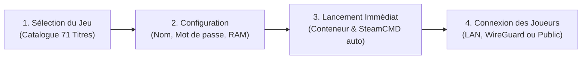

<div align="center">
  
  <br/><br/>

  # 🎮 Noos Game Eggs Hub
  ### *La Plateforme Officielle de Serveurs de Jeux Vidéo Dédiés & Souverains pour Noos NAS*

  [](https://github.com/Chomiam/noos_nas_eggs)
  [](#)
  [](#)
  [](#)
  [](#)
  [](#)
  [](LICENSE)

  <p align="center">
    <strong>Reprenez le contrôle de vos parties multijoueurs. Hébergez vos mondes privés directement sur votre propre serveur de stockage, sans abonnement, sans bridage de slots et sans intermédiaire.</strong>
  </p>
</div>

---

## 🌟 La Révolution du Gaming Privé : Pourquoi Choisir Noos NAS ?

Louer un serveur de jeu auprès d'hébergeurs commerciaux conventionnels (Nitrado, G-Portal, Shockbyte, Zap-Hosting) représente une dépense récurrente inutile, des limitations artificielles sur la mémoire RAM, un bridage du processeur et la perte irrémédiable de vos sauvegardes au moindre retard de paiement.

Avec **Noos Game Eggs Hub**, votre équipement réseau et de stockage domestique se transforme instantanément en une infrastructure de jeu professionnelle :

| Critères | Hébergeurs Traditionnels en Ligne | 🎮 Noos Game Eggs Hub |
| :--- | :--- | :--- |
| **Coût d'utilisation** | 10 € à 45 € par mois et par jeu | **0 € / mois (Rentabilité immédiate)** |
| **Limitation de Joueurs** | Facturation restrictive au slot (ex: 8 à 32 slots) | **Illimité (Selon la puissance de votre matériel)** |
| **Performances & Latence** | Serveurs partagés surchargés (*noisy neighbors*) | **Ressources dédiées, stockage NVMe ultra-véloce** |
| **Propriété des Sauvegardes** | Accès restreint ou suppression après résiliation | **100 % Souverain, sauvegardes locales préservées** |
| **Sécurité & Réseau** | Exposition directe d'adresses IP publiques | **Accès Zero-Trust via VPN WireGuard ou LAN local** |
| **Simplicité d'installation** | Fichiers de configuration manuels et fastidieux | **Déploiement en 1-clic automatisé depuis l'interface** |

---

## ⚡ Les Avantages Clés pour les Joueurs et Administrateurs

- 🚀 **Déploiement Automatisé en 1-Clic** : SteamCMD, compatibilité Proton/Wine pour les binaires Windows, runtimes Java et .NET sont téléchargés et configurés automatiquement par l'Egg.
- 🔒 **Cloisonnement & Isolation Étanches** : Chaque serveur s'exécute dans un conteneur Docker restreint avec quotas mémoires stricts, garantissant l'intégrité absolue de vos fichiers système et de vos partages NAS.
- 🌐 **Connectivité Multijoueur Simplifiée** :
  - **Réseau Local (LAN)** : Jouez avec vos proches sur le même réseau domestique avec une latence quasi-nulle (< 1 ms).
  - **Réseau Privé WireGuard** : Connectez vos amis à distance dans un tunnel chiffré sans ouvrir le moindre port sur votre box internet.
  - **Accès Direct Internet** : Ports de jeu et ports de requête Steam Query pré-assignés pour les communautés publiques.
- 💬 **Console d'Administration & Télé-Commandes** : Accès direct aux consoles interactives en temps réel (`/op`, `/kick`, `/ban`, `/save-all`, console RCON, Telnet).
- 💾 **Protection Anti-Corruption des Données** : Extinction ordonnée avec signaux POSIX adaptés pour forcer la synchronisation du monde sur le disque avant l'arrêt du conteneur.

---

## 🎮 Catalogue Complet des 71 Jeux Certifiés

Chaque Egg a été minutieusement modélisé selon le standard **Pterodactyl V2**, traduit intégralement en français, validé en conditions réelles sous NixOS/Docker et enrichi d'illustrations haute définition (bannières panoramiques 1920×620 et logos officiels).

```
╔═══════════════════════════════════════════════════════════════════════════════════╗
║                      71 SERVEURS DE JEUX DÉDIÉS INTÉGRÉS                          ║
╚═══════════════════════════════════════════════════════════════════════════════════╝
 🏭 Usines, Trains & Gestion : Satisfactory • Factorio • Foundry • Mindustry • OpenTTD
 🦖 Dinosaures & Survie      : ARK: Survival Evolved • ARK: Survival Ascended
 🧟 Apocalypse & Horreur     : 7 Days to Die • Sons of the Forest • The Forest • DayZ
                               Unturned • Project Zomboid • Killing Floor 2 • HumanitZ
                               No More Room in Hell • Night of the Dead • SCP: SL • SCUM
 🎯 FPS & MilSim Tactique    : Counter-Strike 2 • Counter-Strike: Source • Team Fortress 2
                               Left 4 Dead 2 • Garry's Mod • Squad • Insurgency: Sandstorm
                               Arma 3 • Arma Reforger • Black Mesa • Pavlov VR
 ⚔️ RPG, Conquête & Survie   : Valheim • Enshrouded • Conan Exiles • V Rising • Soulmask
                               Abiotic Factor • Icarus • Myth of Empires • Mordhau
                               Mount & Blade II: Bannerlord • Bellwright • Necesse
                               The Lord of the Rings: Return to Moria • Veloren (Rust)
 🌊 Océans & Subaquatique    : Subnautica (Nitrox) • Raft • Sunkenland • Barotrauma
 🚀 Espace & Ingénierie      : Space Engineers • Astroneer • Stationeers • Stormworks
                               Empyrion: Galactic Survival • Starbound • Avorion
                               Space Station 14
 🧱 Voxel & Sandbox          : Minecraft Java • Minecraft Bedrock • Terraria
                               Core Keeper • Vintage Story • Eco • Don't Starve Together
 🏎️ Course & Simulation      : Assetto Corsa • Assetto Corsa Competizione (GT3)
                               BeamNG.drive (BeamMP) • Wreckfest • Euro Truck Simulator 2 / ATS
                               The Front
```

### Grille Technique Détaillée

| Jeu | Catégorie | RAM Recommandée | Ports Réseau | Description & Spécificités de l'Egg |
| :--- | :--- | :--- | :--- | :--- |
| **7 Days to Die** | Survie / Post-Apocalyptique | 8 Go | `26900/both`, `26901/udp`, `26902/udp`, `8081/tcp` | Survivez à la horde du 7ème jour dans un monde voxel hostile. |
| **Abiotic Factor** | Sci-Fi / Survie Coop | 8 Go | `7777/udp`, `27015/udp` | Survivez en tant que scientifiques face à des anomalies paranormales en centre souterrain. |
| **ARK: Survival Ascended** | Survie / Dinosaures | 16 Go | `7777/udp`, `27015/udp`, `27020/tcp` | L'expérience ARK réinventée sous Unreal Engine 5 avec rendu next-gen. |
| **ARK: Survival Evolved** | Survie / Dinosaures | 12 Go | `7777/udp`, `7778/udp`, `27015/udp`, `27020/tcp` | Domptez des dinosaures et survivez sur une île préhistorique mystérieuse. |
| **Arma 3** | Simulation Militaire | 8 Go | `2302/udp`, `2303/udp`, `2304/udp`, `2305/udp` | Simulation de combat militaire réaliste et tactique en monde ouvert gigantesque. |
| **Arma Reforger** | MilSim / Tir Tactique | 8 Go | `2001/udp`, `17777/udp` | Guerre froide sur l'île d'Everon propulsée par le tout nouveau moteur Enfusion. |
| **Assetto Corsa Competizione (GT3)** | Simulation / Course GT3 | 4 Go | `9231/udp`, `9232/tcp`, `9232/udp` | La simulation officielle des championnats GT World Challenge avec météo dynamique. |
| **Assetto Corsa** | Course / Simulation | 4 Go | `9600/both`, `8081/tcp`, `9601/udp` | Simulation de course automobile ultra-réaliste avec physique de pointe. |
| **Astroneer** | Exploration Spatiale | 6 Go | `8777/udp` | Explorez et façonnez des mondes lointains à l'ère des grandes découvertes aérospatiales. |
| **Avorion** | Espace / Bac à Sable | 6 Go | `27000/udp`, `27003/udp`, `27020/tcp` | Construisez votre vaisseau spatial voxel, formez des flottes et conquérez la galaxie. |
| **Barotrauma** | Simulation / Sous-Marin | 4 Go | `27015/udp`, `27016/udp` | Pilotez un sous-marin dans les profondeurs glaciales et hostiles d'Europe. |
| **BeamNG.drive (BeamMP)** | Simulation / Automobile | 2 Go | `8999/udp`, `8999/tcp` | Serveur multijoueur officiel BeamMP pour BeamNG.drive avec physique ultra-réaliste. |
| **Bellwright** | Survie / Médiéval & Gestion | 8 Go | `7777/udp` | Fondez votre village, libérez le royaume et menez vos villageois au combat. |
| **Black Mesa** | FPS Multijoueur | 4 Go | `27015/both` | Le remake officiel et modernisé du mythique Half-Life en affrontement multijoueur. |
| **Conan Exiles** | Survie / Barbares | 8 Go | `7777/udp`, `7778/udp`, `27015/udp` | Survivez, bâtissez et dominez dans les Terres Exilées impitoyables de Conan. |
| **Core Keeper** | Aventure / Sandbox 2D | 4 Go | `27015/udp` | Explorez une caverne sans fin de reliques, de créatures et de ressources en coop. |
| **Counter-Strike 2** | FPS Compétitif | 4 Go | `27015/both`, `27020/udp` | Le summum du tir tactique et compétitif par Valve. |
| **Counter-Strike: Source** | FPS Compétitif | 2 Go | `27015/both` | L'incontournable classique Source du combat terroristes contre antiterroristes. |
| **DayZ** | Survie Post-Apocalyptique | 8 Go | `2302/udp`, `27016/udp` | Survivez à l'infection, aux autres survivants et à la famine en Tcherno. |
| **Don't Starve Together** | Survie / Aventure | 4 Go | `10999/udp`, `11000/udp` | Explorez et survivez ensemble dans un univers hostile façonné à la main. |
| **Eco** | Écologie & Civilisation | 8 Go | `3000/both`, `3001/both` | Bâtissez une civilisation florissante pour détruire un météore sans ruiner l'écosystème. |
| **Empyrion: Galactic Survival** | Survie Galactique | 8 Go | `30000/udp`, `30001/udp`, `30002/udp` | Aventure spatiale 3D avec exploration planétaire, construction et combats. |
| **Enshrouded** | Survie / Action RPG | 8 Go | `15636/udp`, `15637/udp` | Explorez le royaume déchu d'Embervale dans ce RPG de survie voxel. |
| **Euro Truck Simulator 2 & ATS** | Simulation / Convois | 4 Go | `27015/udp`, `27016/udp` | Serveur de convoi persistant officiel pour Euro Truck Simulator 2 et American Truck Simulator. |
| **Factorio Headless Server** | Automatisation / Gestion | 4 Go | `34197/udp`, `27015/tcp` | Construisez et défendez des usines automatisées géantes sur une planète hostile. |
| **Foundry** | Usine & Voxel | 8 Go | `22500/udp` | Automatisez une usine colossale dans un monde voxel infini généré procéduralement. |
| **Garry's Mod** | Bac à sable Source | 4 Go | `27015/both`, `27005/udp` | Sandbox physique multijoueur légendaire sous Source Engine (TTT, DarkRP). |
| **HumanitZ** | Survie Post-Apocalyptique | 6 Go | `7777/udp`, `27015/udp` | Survie en vue isométrique dans un monde ouvert envahi par les Zeeks. |
| **Icarus** | Survie Sci-Fi | 12 Go | `17777/udp`, `27015/udp` | Survivez sur une planète terraformée hostile lors de missions chronométrées. |
| **Insurgency: Sandstorm** | FPS Tactique | 6 Go | `27102/udp`, `27131/udp`, `27015/tcp` | FPS tactique hardcore en combats urbains au Moyen-Orient axé sur le jeu d'équipe. |
| **Killing Floor 2** | Horreur / Coopératif | 4 Go | `7777/udp`, `27015/udp`, `8080/tcp`, `20560/udp` | Affrontez des vagues incessantes de spécimens mutants Zeds à 6 joueurs en coop. |
| **Left 4 Dead 2** | Horreur / Coopératif | 4 Go | `27015/both` | Survivez à l'apocalypse zombie à 4 en coopération intense à travers le Sud des USA. |
| **Mindustry** | Stratégie / Logistique & Usines | 2 Go | `6567/tcp`, `6567/udp` | Gestion de convoyeurs, production industrielle et défense de base multijoueur. |
| **Minecraft: Bedrock Edition** | Bac à sable / Survie | 2 Go | `19132/udp` | Serveur officiel Mojang BDS pour consoles, smartphones et Windows 10/11. |
| **Minecraft: Java Edition** | Bac à sable / Survie | 4 Go | `25565/both` | Serveur Minecraft Java haute performance propulsé par PaperMC 1.21+. |
| **Mordhau** | Combat Médiéval | 6 Go | `7777/udp`, `27015/udp`, `10000/tcp` | Combats médiévaux sanglants et précis à la première personne à grande échelle. |
| **Mount & Blade II: Bannerlord** | Action / Médiéval & Stratégie | 8 Go | `7210/udp` | Affrontements et sièges de châteaux massifs dans l'univers de Calradia. |
| **Myth of Empires** | Sandbox Multijoueur Médiéval | 12 Go | `7777/udp`, `27015/udp` | Bâtissez un empire oriental féodal, recrutez des armées et menez des sièges colossaux. |
| **Necesse** | Aventure / Action-RPG | 3 Go | `14159/udp` | Explorez des îles infinies, recrutez des colons et battez des boss légendaires. |
| **Night of the Dead** | Tower Defense / Survie | 8 Go | `7777/udp`, `27015/udp` | Construisez une forteresse bardée de pièges mécaniques pour repousser les hordes nocturnes. |
| **No More Room in Hell** | Horreur / Survie Coop | 2 Go | `27015/both` | Survie réaliste et désespérée face à la mort vivante inspirée des films de Romero. |
| **OpenTTD** | Gestion / Transports & Trains | 1 Go | `3979/tcp`, `3979/udp` | Le simulateur de réseau ferroviaire et de transport de marchandises légendaire. |
| **Palworld** | Aventure / Survie | 8 Go | `8211/udp` | Serveur multijoueur Palworld avec multithreading et persistance. |
| **Pavlov VR** | VR / Tir Tactique | 6 Go | `7777/udp` | Le FPS tactique compétitif numéro 1 en réalité virtuelle. |
| **Project Zomboid** | Survie Zombie Hardcore | 4 Go | `16261/udp`, `16262/udp` | L'ultime simulateur de survie apocalypse zombie en multijoueur. |
| **Raft** | Survie / Océan & Co-op | 4 Go | `27015/udp` | Survivez sur un radeau de fortune, pêchez les débris et découvrez les secrets de l'océan. |
| **Rust** | Survie PvP / Sandbox | 8 Go | `28015/udp`, `28016/tcp` | Survie sans pitié, construction de base et PvP brutal. |
| **Satisfactory** | Usine & Automatisation | 8 Go | `7777/udp`, `8888/udp` | Construisez des usines colossales et automatisez la production sur une planète alien. |
| **SCP: Secret Laboratory** | Horreur / Survie Multijoueur | 4 Go | `7777/udp` | Survivez aux anomalies du site de confinement ou éliminez les intrus. |
| **SCUM** | Survie / Réalisme Extrême | 10 Go | `7777/udp`, `27015/udp` | Survie pénitentiaire hyper-réaliste sur une île impitoyable avec métabolisme poussé. |
| **Sons of the Forest** | Horreur / Survie | 8 Go | `8766/udp`, `27016/udp`, `9700/udp` | Survivez aux cannibales et mutants sur une île isolée cauchemardesque. |
| **Soulmask** | Survie / Tribale | 8 Go | `8777/udp`, `27015/udp` | Échappez au rituel sacrificiel et découvrez les secrets des masques ancestraux. |
| **Space Engineers** | Simulation Spatiale | 12 Go | `27016/udp` | Construisez des vaisseaux, stations spatiales et avant-postes planétaires réalistes. |
| **Space Station 14** | Simulation / Jeu de Rôle Spatial | 3 Go | `1212/udp` | Remake moderne et chaotique en C# de Space Station 13 à bord d'une station de recherche. |
| **Squad** | FPS Tactique | 8 Go | `7787/udp`, `27165/udp`, `21114/tcp` | Combats tactiques par escouades combinées à grande échelle à 100 joueurs. |
| **Starbound** | Sandbox Spatial 2D | 4 Go | `21025/tcp` | Explorez un univers procédural infini à bord de votre propre vaisseau spatial. |
| **Stationeers** | Ingénierie Spatiale | 6 Go | `27016/udp`, `27015/udp` | Gérez la pression, l'atmosphère et les circuits d'une station spatiale complexe. |
| **Stormworks: Build and Rescue** | Sauvetage / Véhicules | 6 Go | `25564/both` | Concevez hélicoptères, bateaux et sous-marins pour des missions de sauvetage héroïques. |
| **Subnautica** | Survie / Exploration Sous-Marine | 4 Go | `11000/udp` | Explorez les fonds marins de la planète 4546B en coopération avec le mod Nitrox. |
| **Sunkenland** | Survie / Océan & Exploration | 8 Go | `27015/udp`, `27016/udp` | Survie post-apocalyptique dans un monde submergé : plongée, bases flottantes et raids. |
| **Team Fortress 2** | FPS Compétitif | 4 Go | `27015/both`, `27005/udp` | Le FPS par équipes légendaire de Valve aux 9 classes emblématiques. |
| **Terraria** | Aventure / Sandbox 2D | 2 Go | `7777/both` | Exploration, construction et combats de boss en 2D multijoueur. |
| **The Forest** | Horreur / Survie | 6 Go | `27016/udp`, `8766/udp`, `27015/udp` | Construisez, explorez et survivez dans une forêt infestée de cannibales. |
| **The Front** | Survie / Militaire & Sandbox | 10 Go | `7777/udp`, `27015/udp` | Guerre post-apocalyptique, véhicules blindés, tourelles et défense de base contre les vagues. |
| **The Lord of the Rings: Return to Moria** | Survie / Fantasy & Co-op | 8 Go | `7777/udp` | Reconquérez et reconstruisez le royaume perdu de la Moria avec vos compagnons nains. |
| **Unturned** | Survie / Post-Apocalyptique | 4 Go | `27015/both`, `27016/udp` | Survie zombie voxel en monde ouvert avec artisanat, conduite et barricades. |
| **V Rising** | Action RPG / Vampires | 8 Go | `9876/udp`, `9877/udp` | Réveillez-vous en vampire, bâtissez votre château gothique et régnez sur Vardoran. |
| **Valheim** | Survie Mythologique | 4 Go | `2456/udp`, `2457/udp` | Serveur dédié viking persistant dans un monde procédural nordique. |
| **Veloren** | RPG / Voxel Open-Source (Rust) | 3 Go | `14004/udp` | RPG multijoueur open-source développé en Rust dans un monde féérique en voxels. |
| **Vintage Story** | Survie / Voxel Réaliste | 4 Go | `42420/tcp` | Survie hardcore intransigeante dans un monde voxel axée sur la géologie et l'artisanat. |
| **Wreckfest** | Course / Destruction | 6 Go | `27015/udp`, `27016/udp`, `33540/udp` | Courses de banger et derbies de démolition avec gestion de dégâts poussée. |

---

## 🖥️ Déploiement en 3 Étapes depuis le Noos NAS Dashboard

L'intégration native dans le [Noos NAS Dashboard](https://github.com/Chomiam/noos-nas-dashboard) rend la gestion d'un serveur de jeu aussi simple que l'installation d'une application mobile :



1. **Parcourez le Catalogue** : Accédez à l'onglet **Serveurs de Jeux** et sélectionnez votre titre parmi les 71 jeux certifiés.
2. **Personnalisez votre Monde** : Ajustez la mémoire allouée, donnez un nom à votre serveur et définissez un mot de passe optionnel.
3. **Jouez immédiatement** : Cliquez sur **Déployer**. Le tableau de bord télécharge automatiquement les fichiers du jeu via SteamCMD, applique les paramètres de sécurité et lance le serveur.
4. **Partagez les accès** : Les adresses IP de connexion (Locale, WireGuard et Publique) s'affichent instantanément pour vos amis.

---

## 🛠️ Structure & Anatomie d'un Egg Noos NAS

Le catalogue repose sur une architecture déclarative stricte et reproductible :

```text
noos_nas_eggs/
├── catalog.json              # Index global de distribution déclaratif (v1.3.0)
├── README.md                 # Vitrine et documentation commerciale
├── assets/
│   └── logo.png              # Logo officiel haute définition Noos NAS
└── eggs/
    └── <nom_du_jeu>/
        ├── egg.json          # Spécification Pterodactyl V2 (variables, ports, commande)
        ├── icon.png          # Logo officiel haute définition / capsule carrée
        └── banner.jpg        # Bannière panoramique au ratio 1920x620
```

### Extrait Déclaratif (`egg.json`)

```json
{
  "id": "valheim",
  "name": "Valheim Dedicated Server",
  "author": "Iron Gate & Noos NAS",
  "category": "Survie Mythologique",
  "icon": "⚔️",
  "tagline": "Serveur dédié viking persistant dans un monde procédural nordique",
  "steam_app_id": "896660",
  "docker_image": "ghcr.io/parkervcp/steamcmd:debian",
  "default_port": 2456,
  "port_protocol": "udp",
  "extra_ports": [
    { "port": 2457, "protocol": "udp", "description": "Port Steam Query" }
  ],
  "default_memory_mb": 4096,
  "min_memory_mb": 2048,
  "startup_cmd": "./valheim_server.x86_64 -name \"{{SERVER_NAME}}\" -port {{SERVER_PORT}} -world \"{{WORLD_NAME}}\" -password \"{{SERVER_PASSWORD}}\" -public 1",
  "is_custom": false
}
```

---

## 🤝 Contribuer au Hub de Jeux Noos

La communauté Noos NAS s'enrichit chaque jour de nouveaux serveurs de jeu :
1. **Forkez** le dépôt [Chomiam/noos_nas_eggs](https://github.com/Chomiam/noos_nas_eggs).
2. Créez un nouveau dossier sous `eggs/<identifiant_du_jeu>/`.
3. Ajoutez votre définition `egg.json`, une icône `icon.png` et une bannière 1920×620 `banner.jpg`.
4. Testez le démarrage de votre conteneur avec le banc de test `python3 scripts/test_eggs.py`.
5. Proposez une **Pull Request** pour que tous les utilisateurs de Noos NAS puissent en bénéficier !

---

## 📄 Licence

Ce projet est distribué sous licence libre et copyleft **GNU General Public License v3.0 (GPLv3)**.  
Consultez le fichier [LICENSE](LICENSE) pour plus d'informations.

---

<div align="center">
  <sub>Fait partie de l'écosystème officiel <a href="https://github.com/Chomiam/noos-nas">Noos NAS Edition</a>. Conçu pour la performance, la sécurité et la souveraineté numérique.</sub>
</div>
